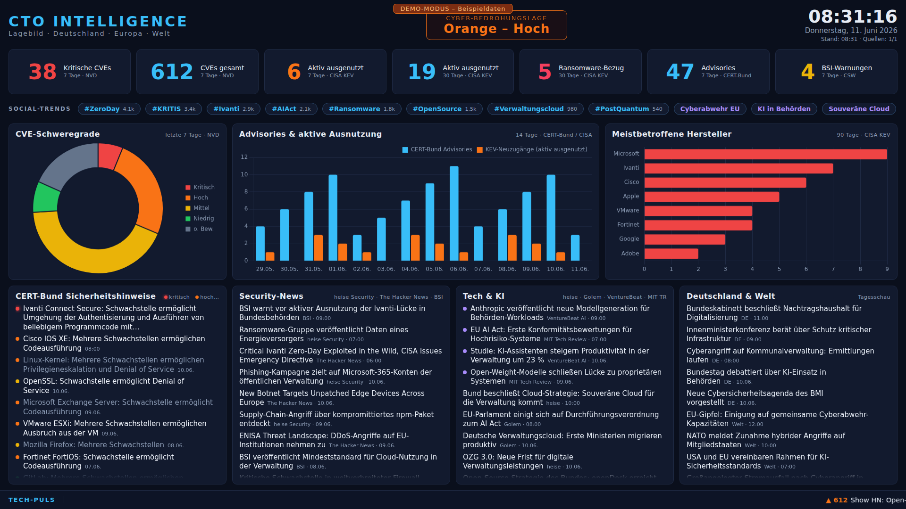

# CTO Intelligence Dashboard

Kiosk-Dashboard für die Leitungsebene (CTO) eines Ministeriums: aggregiert
**Cyber-Bedrohungslage** sowie **Tech-, KI- und Nachrichtenlage** für
Deutschland, Europa und die Welt auf einem einzigen 1080p-Bildschirm –
grafisch, ohne Interaktion, dauerlauffähig.



## Rechercheergebnis: Welche Informationen sind relevant?

Für ein behördliches Lagebild haben sich vier Informationsblöcke als
relevant herausgestellt, jeweils mit frei zugänglichen, maschinenlesbaren
Quellen (keine API-Schlüssel erforderlich):

### 1. Bedrohungslage (Deutschland / Europa / Welt)

| Quelle | Format | Inhalt | Warum relevant |
|---|---|---|---|
| [CERT-Bund WID](https://wid.cert-bund.de/content/public/securityAdvisory/rss) | RSS | Security Advisories des BSI mit Risikoklasse (`[kritisch]`, `[hoch]` …) | Offizielle deutsche Schwachstellen-Warnungen, direkt patchrelevant |
| [BSI Cyber-Sicherheitswarnungen (CSW)](https://www.bsi.bund.de/SiteGlobals/Functions/RSSFeed/RSSNewsfeed/RSSNewsfeed_CSW.xml) | RSS | BSI-IT-Sicherheitsmitteilungen | Lagerelevante Warnungen oberhalb der Einzel-Advisories |
| [CERT-EU](https://cert.europa.eu/publications/security-advisories-rss) | RSS | Advisories für EU-Institutionen | Europäische Ebene |
| [CISA KEV](https://www.cisa.gov/known-exploited-vulnerabilities-catalog) | JSON | Katalog **aktiv ausgenutzter** Schwachstellen inkl. Ransomware-Flag | Der beste öffentliche Indikator für reale Ausnutzung („was brennt wirklich") |
| [NVD CVE API 2.0](https://nvd.nist.gov/developers/vulnerabilities) | JSON | Alle neuen CVEs inkl. CVSS-Schweregrad | Mengengerüst und Schweregradverteilung als Trend-KPI |
| heise Security, [The Hacker News](https://feeds.feedburner.com/TheHackersNews) | RSS/Atom | Security-Berichterstattung DE + international | Kontext zu Vorfällen, Ransomware, APT-Kampagnen |

> Hinweis: **ENISA hat ihre RSS-Feeds mit dem Website-Relaunch eingestellt**
> ([Ankündigung](https://www.enisa.europa.eu/rss-feeds-discontinued-new-subscription-mechanism-coming-soon));
> die EU-Ebene wird daher über CERT-EU abgedeckt.

### 2. Tech-Themen

- **heise online** und **Golem.de** (RSS): deutsche Tech-/Digitalpolitik-Berichterstattung
- **Hacker News Top Stories** ([Firebase-API](https://github.com/HackerNews/API)): internationales „Tech-Puls"-Signal inkl. Score (läuft als Ticker)

### 3. KI-Themen

- **VentureBeat AI** und **MIT Technology Review** (RSS): Industrie- und Forschungsperspektive auf KI

### 4. Social-Media-Trends

- **Mastodon Trending Tags** (`mastodon.social` für Breite,
  `infosec.exchange` für Security-Fokus): öffentliche API ohne Key,
  inkl. Nutzungszahlen der letzten 48 h
- **Bluesky Trending Topics**: öffentliche API ohne Key
- Ein **CTO-Relevanzfilter** (`CTO_TOPIC_PATTERNS` in `src/aggregator.js`)
  sortiert Tech-/Security-/KI-/Digitalpolitik-Themen nach vorn; fachfremde
  Trends füllen nur auf und werden gedimmt dargestellt.
- **X (Twitter) und Instagram bieten keine frei zugängliche Trends-API**:
  X-Trends gibt es nur über die kostenpflichtige API (Pro-Tier), Instagram
  hat gar keinen Trends-Endpunkt. Bei vorhandenem X-API-Zugang lässt sich
  ein Fetcher in `src/fetchers.js` ergänzen (Endpoint
  `GET /2/trends/by/woeid/:id`, Bearer-Token als Env-Variable).

### 5. Allgemeine Lage Deutschland / Welt

- **Tagesschau api2u** ([inoffiziell dokumentierte JSON-API](https://github.com/bundesAPI/tagesschau-api)),
  Ressorts `inland` und `ausland`. Limit 60 Requests/h – der serverseitige
  Cache (15 min TTL) bleibt weit darunter. Nutzung nur für interne,
  nicht-kommerzielle Anzeige.

## Aggregationskonzept

```
Feeds/APIs ──> Node.js-Server (Aggregator)            ──> Browser im Kiosk-Modus
               · holt alle Quellen serverseitig            · 1 JSON-Endpunkt /api/dashboard
               · Cache je Quelle (10–60 min TTL)           · Chart.js (lokal ausgeliefert)
               · stale-while-error: bei Ausfall            · Auto-Refresh alle 5 min
                 einer Quelle bleibt der letzte            · Uhr, Lage-Badge, Ticker
                 gute Stand stehen                         · Seiten-Reload alle 6 h
```

Entscheidungen:

- **Serverseitige Aggregation** statt Browser-Fetch: umgeht CORS, schont die
  Quellen (ein Cache für beliebig viele Bildschirme) und hält API-Limits ein
  (NVD: 5 Requests/30 s ohne Key, Tagesschau: 60/h).
- **Kein Build-Schritt, keine Datenbank**: ein `npm install`, ein Prozess.
  Chart.js wird lokal aus `node_modules` ausgeliefert – das Dashboard braucht
  im Betrieb keine CDNs.
- **Fehler werden angezeigt, nicht kaschiert**: Fällt eine Quelle aus, zeigt
  das Panel „Quelle derzeit nicht erreichbar" bzw. der Quellen-Zähler im
  Header (`Quellen: 12/14`) wird orange. Es werden **nie** stillschweigend
  Beispieldaten eingeblendet.

## KPIs und Visualisierungen

- **Lage-Badge** (Grün/Gelb/Orange/Rot): Heuristik in Anlehnung an die
  vierstufige BSI-Skala, berechnet aus kritischen CVEs (7 Tage),
  KEV-Neuzugängen (7 Tage) und Ransomware-Bezug (30 Tage).
  *Keine offizielle BSI-Lageeinstufung* – Schwellwerte in
  `src/aggregator.js` (`computeThreatLevel`) anpassbar.
- **7 KPI-Karten**: kritische CVEs, CVEs gesamt, aktiv ausgenutzte
  Schwachstellen (7/30 Tage), Ransomware-Bezug, CERT-Bund-Advisories, BSI-Warnungen
- **Donut**: CVE-Schweregradverteilung (NVD, 7 Tage)
- **Balken-Zeitreihe**: CERT-Bund-Advisories vs. KEV-Neuzugänge (14 Tage)
- **Hersteller-Ranking**: meistbetroffene Vendoren im KEV-Katalog (90 Tage)
- **4 Listen-Panels**: CERT-Bund (mit Risikoklasse-Badges), Security-News,
  Tech & KI, Deutschland & Welt
- **Lauf-Ticker**: Hacker-News-Topstories (mit Score) + CERT-EU-Advisories

## Betrieb

```bash
npm install
npm start            # http://localhost:3000
npm run demo         # Demo-Modus mit Beispieldaten (für Layout-Tests ohne Internet)
PORT=8080 npm start  # anderer Port
```

Voraussetzung: Node.js ≥ 18. Der Server braucht ausgehenden HTTPS-Zugriff auf
die oben gelisteten Quellen (ggf. Proxy-Freigaben beantragen).

### Hosting auf Vercel

Das Repo ist Vercel-ready: `public/` wird statisch ausgeliefert,
`api/dashboard.js` läuft als Serverless Function, das CDN cached die
Aggregation 5 Minuten (`s-maxage=300`).

1. Repo nach GitHub pushen bzw. Branch in `main` mergen.
2. Auf [vercel.com](https://vercel.com) → **Add New… → Project** → das Repo
   importieren. Framework-Preset **Other** – alle Einstellungen kommen aus
   der mitgelieferten `vercel.json`, nichts anpassen.
3. **Deploy** klicken. Das Dashboard liegt danach unter
   `https://<projekt>.vercel.app`, die Daten unter `/api/dashboard`.

Alternativ per CLI: `npm i -g vercel && vercel --prod` im Projektordner.

Hinweise:

- **Demo-Modus**: In den Projekt-Settings die Environment-Variable `DEMO=1`
  setzen (und redeployen), um nur Beispieldaten zu zeigen.
- **Funktionslaufzeit**: Die NVD-Abfrage kann durch das Rate-Limit 30–45 s
  dauern; `vercel.json` setzt deshalb `maxDuration: 60`. Dank CDN-Cache
  trifft das nur ca. einen Request alle 5 Minuten.
- **Öffentlich erreichbar**: Ein Vercel-Deployment ist standardmäßig öffentlich.
  Für ein internes Lagebild Schutz vorschalten (Vercel Deployment Protection /
  Password Protection oder eigenes SSO).

### Kiosk-Modus (1080p-Monitor)

Chromium/Chrome im Kiosk-Modus starten:

```bash
chromium --kiosk --noerrdialogs --disable-session-crashed-bubble \
         --autoplay-policy=no-user-gesture-required \
         http://localhost:3000
```

Für Dauerbetrieb (z. B. Raspberry Pi / Mini-PC am Monitor):

```ini
# /etc/systemd/system/cto-dashboard.service
[Unit]
Description=CTO Intelligence Dashboard
After=network-online.target

[Service]
WorkingDirectory=/opt/cto-intelligence
ExecStart=/usr/bin/node server.js
Restart=always
Environment=PORT=3000

[Install]
WantedBy=multi-user.target
```

Zusätzlich Bildschirmschoner/DPMS deaktivieren (`xset s off -dpms`). Das
Frontend lädt sich alle 6 Stunden selbst neu und holt alle 5 Minuten frische
Daten – manuelle Eingriffe sind nicht nötig.

## Struktur

```
server.js            Express-Server, /api/dashboard, statische Auslieferung
src/fetchers.js      HTTP-/RSS-/API-Clients (Timeout, User-Agent, NVD-Paginierung)
src/aggregator.js    Quellenkatalog, Cache, KPI-/Chart-Berechnung, Lage-Heuristik
src/demo-data.js     Beispieldaten für den Demo-Modus
public/              Kiosk-Frontend (HTML/CSS/JS, Chart.js lokal)
```

## Erweiterungsideen

- Anbindung interner Quellen (SIEM-Kennzahlen, Ticket-Backlog, Verfügbarkeit
  eigener Fachverfahren) als zusätzliche Panels
- MISP-/OpenCTI-Anbindung für behördliche Threat-Intelligence
- BSI-Lagebericht-/IT-Lagezentrum-Einstufung manuell pflegbar machen
  (überschreibt die Heuristik)
- Mehrere rotierende Ansichten (z. B. Seite 2 mit Detail-Charts) per
  zeitgesteuertem Umschalten
